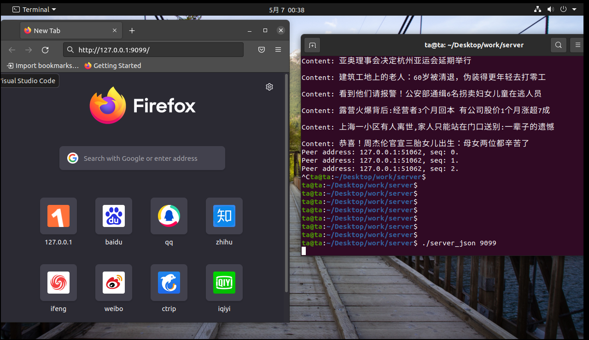
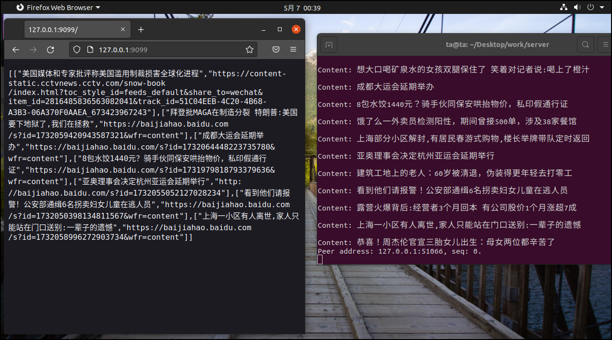

# 概述
该程序是一个（服务器程序），其实现了以下功能：
1. 从[news.baidu.com](http://news.baidu.com)获取**热点要闻**里面的**标题**、**url**。
2. 把上述收集的**标题**发往[情感计算](http://www.pullword.com/baobian)，得到**标题**的**情感计算数值**，该值为（json）格式。
3. 判断**情感计算数值**为**正面情感or负面情感**，向客户端展示**负面情感**的**标题**以及其对应的**url**，该值为（json）格式。
    * 注：**情感计算数值**大于0.5表示**正面情感**，小于-0.5表示**负面情感**。

## 主要函数

### 服务端的函数

```cpp
void process(WFHttpTask *server_task)
static WFFacilities::WaitGroup wait_group(1)
void sig_handler(int signo)
```
上面三个函数，主要作用是处理客户端的访问，具体原理，请参考：
* [tutorial-04-http_echo_server](https://github.com/pennyliang/workflow/blob/master/docs/tutorial-04-http_echo_server.md)


### html、json数据处理函数
```cpp
void getOrUpadate_html()
string parse_html()
string collection_elements_to_json(lxb_dom_collection_t *collection)
```

【getOrUpadate_html()】函数：
* 在函数中调用【shell】的【curl -s "http://news.baidu.com" > baidu.html】，得到【http://news.baidu.com】的内容，并存到【baidu.html】中。

【parse_html()】函数：
* 处理【baidu.html】，提取【热点要闻】的内容，存储在【lxb_dom_collection_t *collection_a】里面，以其为参数，调用【collection_elements_to_json(lxb_dom_collection_t *collection)】函数，正常情况，返回值为【collection_elements_to_json(lxb_dom_collection_t *collection)】函数的返回值。

【collection_elements_to_json(lxb_dom_collection_t *collection)】函数：
* 处理刚刚得到的【lxb_dom_collection_t *collection_a】，在函数中调用【shell】的【curl -s -X POST 'http://baobianapi.pullword.com:9091/get.php' -d '（对应的标题）'】，得到【对应的标题】的【情感计算数值】，然后判断【情感计算数值】为【正面情感or负面情感】，输出对应的【负面情感】的（【标题】以及其对应的【url】）的集合，该集合是json格式的【string】。

上述函数，主要调用了：
* 【lexbor】这个库的函数来处理html
* 【jsoncpp】两个库的函数来处理json

具体参考：
* [lexbor](https://github.com/lexbor/lexbor)
* [jsoncpp](https://github.com/open-source-parsers/jsoncpp)

## 编译、运行

1. 按照【[0x00-搭建环境](0x00-configuration.md)】的步骤，搭建好环境后。
2. 把【base.h】与源代码【server_json.cpp】放在同一目录下。
3. 编译：
```
g++ -std=c++11  -I /opt/sogou/include/  -o server_json server_json.cpp  /opt/sogou/lib/libworkflow.a  -lssl -lpthread -lcrypto -llexbor -ljsoncpp
```
4. 运行：
```
./server_json 9099
```

得到的结果：


